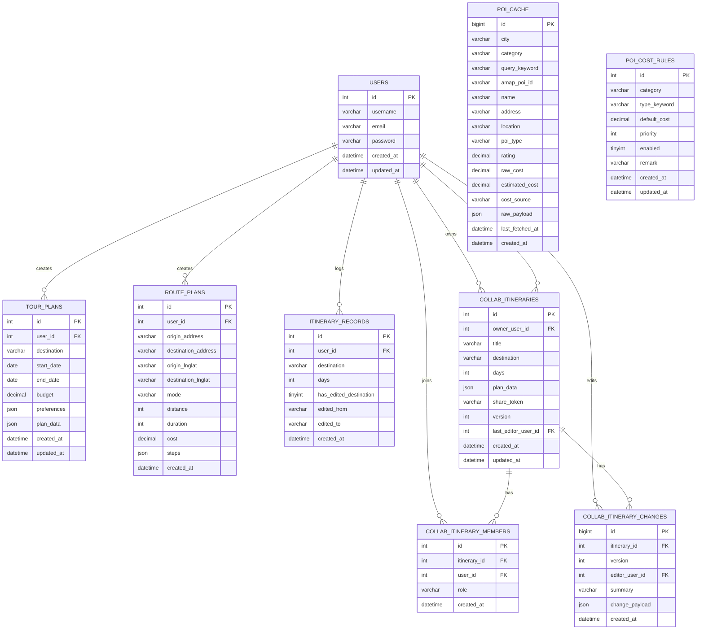

目录
1绪论	1
1.1研究背景与意义	1
1.2国内外研究现状	2
1.3研究内容与创新点	3
1.4论文结构安排	4
2相关技术介绍	5
2.1开发环境与工具链	5
2.1.1前端开发环境（Vue3/Vite/TypeScript）	6
2.1.2后端开发环境（Flask/Python/MySQL）	7
2.1.3第三方服务与部署环境（高德地图/Socket.IO）	8
2.2关键技术	9
2.2.1前后端分离与RESTful API	9
2.2.2WebSocket实时通信机制	10
2.2.3缓存与数据一致性策略	11
3需求分析	12
3.1业务需求分析	12
3.1.1用户角色与使用场景	13
3.1.2核心功能需求	14
3.2非功能需求分析	15
3.3可行性分析	18
4系统总体设计	21
4.1系统开发流程	21
4.2系统架构设计	22
4.2.1前端架构设计	22
4.2.2后端架构设计	23
4.2.3数据库与核心表设计	24
4.3核心业务流程设计	25
4.3.1行程生成流程	25
4.3.2协作会话流程	26
5POI数据聚合与缓存设计	27
5.1POI数据来源与分类映射策略	27
5.2多关键词与分页聚合策略	28
5.3缓存表结构与写入更新机制	29
5.4费用估算规则与预算映射	30
5.5候选池容量与多样性优化	31
6可解释推荐与预算约束的多日行程生成设计与实现	32
6.1多日行程建模与约束定义	32
6.2推荐排序策略与可解释性输出	33
6.4路线组织与日程节奏生成	35
6.5算法流程与接口实现	36
7行程编辑与轻量实时协作实现	37
7.1协作会话模型与权限设计	37
7.2WebSocket与轮询双通道同步	38
7.3版本控制与冲突检测处理	39
7.4协作变更日志与可追溯机制	40
7.5前端协作交互实现	41
8系统测试与结果分析	42
8.1测试环境与测试数据	42
8.2功能测试	43
8.3性能测试	46
8.4结果分析与问题讨论	48
9总结与展望	49
9.1工作总结	49
9.2不足与改进方向	50
9.3未来展望	51
参考文献	52
致谢	53

# 4 系统总体设计

## 4.2 系统架构设计

系统采用前后端分离的三层架构，分为表现层（Vue3 单页应用）、业务层（Flask API + Socket.IO 实时协作）与数据层（MySQL + POI 缓存），同时通过高德地图服务补充地理与 POI 信息。整体链路是“前端请求 -> 后端聚合/计算 -> 数据库存储 -> 前端展示”，协作链路则是“前端 WebSocket -> 协作房间 -> 变更落库”。

### 4.2.1 前端架构设计

- 视图层：基于 Vue3 组件化组织页面，关键页面包括行程生成、编辑协作、管理后台与历史记录。
- 路由层：使用 Vue Router 管理多视图切换，结合路由守卫完成登录态控制。
- 状态层：使用 Pinia 管理用户信息、行程数据、协作会话状态与缓存数据。
- 服务层：按领域拆分 `api/` 请求模块，统一封装鉴权头、错误处理与重试策略。
- 实时协作：`services/collabSocket.ts` 通过 Socket.IO 与后端建立长连接，支持变更同步与版本校验。

### 4.2.2 后端架构设计

- 接口层：Flask 提供 RESTful API（登录、行程生成、路线规划、POI 查询、管理统计等）。
- 认证层：JWT 负责身份鉴权，区分普通用户与管理员权限范围。
- 业务层：包含行程规划引擎、POI 聚合与缓存写入、协作会话管理、变更记录落库。
- 协作层：Flask-SocketIO 管理房间、成员与广播，支持实时编辑与版本控制。
- 数据层：MySQL 存储用户、行程、路线、协作与 POI 缓存数据，部分字段以 JSON 形式保存结构化结果。

### 4.2.3 数据库与核心表设计

数据库以用户为中心组织数据，核心实体包括：用户、行程方案、路线规划、行程生成记录、协作行程、协作成员、协作变更、POI 缓存与 POI 费用规则。表之间关系如下：

- `users` 与 `tour_plans`、`route_plans`、`itinerary_records` 为一对多。
- `users` 与 `collab_itineraries`（owner_user_id）为一对多；并通过 `collab_itinerary_members` 形成多对多协作关系。
- `collab_itineraries` 与 `collab_itinerary_changes` 为一对多，记录协作变更历史。
- `poi_cache` 与 `poi_cost_rules` 为独立缓存/规则表，不直接依赖用户表。

ER 图如下（关键字段与外键关系已标注）：



# 6 可解释推荐与预算约束的多日行程生成设计与实现

本章围绕 POI 推荐算法的公式、参数含义与工程化实现进行总结，强调可解释性与预算约束的联动效果。

## 6.3 POI 推荐算法公式与参数影响（八点总结）

### 6.3.1 推荐流程与数据链路

推荐链路遵循“多关键词检索 -> 候选池聚合 -> 评分排序 -> 多样化抽样 -> 结果解释输出”的流程。首先根据类别与偏好构造查询计划并分页聚合候选 POI；随后对候选池计算综合评分并排序；再通过类型分桶轮询实现多样化；最后输出推荐列表及理由，同时为后续行程生成提供可复用的排序结果。

### 6.3.2 综合评分公式与权重配置

综合评分采用线性加权模型：

$$
S = w_r \cdot s_r + w_d \cdot s_d + w_i \cdot s_i + w_b \cdot s_b + w_o \cdot s_o
$$

其中 $S$ 为最终得分，$s_r$、$s_d$、$s_i$、$s_b$、$s_o$ 分别表示评分、距离、兴趣、预算与开放时间得分；$w_*$ 为权重。权重由推荐侧重参数 `recommend_focus` 决定：当偏好口碑时提升 $w_r$，当偏好距离时提升 $w_d$，其余权重保持均衡以确保推荐稳定性。

### 6.3.3 子评分定义与参数意义

评分得分采用 $s_r = rating/5$，当评分缺失时使用中性值 0.70，避免缺失信息导致极端惩罚。距离得分采用线性衰减：

$$
s_d = 1 - \frac{\min(distance, 12000)}{12000}
$$

兴趣得分基于偏好关键词命中率：

$$
s_i = \frac{\text{命中关键词数量}}{\text{关键词总数}}
$$

预算得分根据费用与目标预算的偏离程度计算；低于预算时保持较高分值，上浮时逐步惩罚以抑制超预算推荐。开放时间得分依据营业时段与到访时间匹配程度赋值，明确开放时给高分，未知或不匹配时给中性或低分。上述子评分共同构成可解释的评分结构，使推荐结果可追溯、可调参。

### 6.3.4 预算目标与城市因子

日预算由总预算与天数确定：

$$
daily\_budget = \frac{total\_budget}{days}
$$

类别预算目标采用比例系数控制，并引入城市消费因子 $f_{city}$ 校正不同城市的消费水平：

$$
budget\_target = \max(budget\_floor, daily\_budget \cdot ratio \cdot f_{city})
$$

其中景点类比例更敏感于城市层级，餐饮与住宿采用相对稳定的比例。城市因子使得一线与新一线城市的景点预算上调，避免因预算过低导致推荐质量下降。

### 6.3.5 多样化抽样策略

在评分排序后，引入类型分桶轮询策略：将 POI 按主类型聚类并轮流抽取，以降低同质化堆叠。该策略在不显著牺牲高分排序的前提下提升内容多样性，避免推荐列表被单一类别占满。

### 6.3.6 费用估算与校准机制

对于缺失或异常费用的 POI，采用预算区间与关键词锚点进行估算，并引入可复现的轻微波动：

$$
value = clamp(anchor + jitter, low, high)
$$

其中 $anchor$ 为预算锚点或关键词锚点，$low/high$ 为该类别的预算区间上下界。若原始费用过高或过低，则触发校准机制回退到估算值，以保证费用更符合目标预算并减少异常值影响。

### 6.3.7 候选池扩增与查询计划

为降低候选池不足风险，采用多关键词查询计划与分页聚合策略，并在必要时使用周边检索补量。该策略提高了候选池覆盖度，特别是在启用全局去重或行程天数较多时，能有效减少“自由探索”兜底场景。

### 6.3.8 去重规则与唯一性控制

去重采用“名称 + 地址 + 坐标”的组合特征生成唯一键，对重复 POI 进行过滤。该策略在保留多样性的同时提升推荐列表质量，避免相同地点因名称或格式差异被重复展示。

# 8 系统测试与结果分析

## 8.2 功能测试

功能测试以前端用户路径为主，重点覆盖“未登录访问保护页 -> 跳转登录页”“已登录访问首页 -> 展示行程生成界面”等关键流程。测试采用 Playwright 执行端到端场景，避免依赖后端接口即可完成核心页面渲染与路由校验。

功能测试代码位于 [vue-graduation-design/e2e/functional.spec.ts](vue-graduation-design/e2e/functional.spec.ts)。

```ts
import { test, expect } from '@playwright/test'

test('redirects unauthenticated users to auth page', async ({ page }) => {
	await page.goto('/')
	await expect(page).toHaveURL(/\/auth$/)
	await expect(page.getByRole('heading', { name: '欢迎回来' })).toBeVisible()
})

test('shows planner page when session is present', async ({ page }) => {
	await page.addInitScript(() => {
		sessionStorage.setItem('authToken', 'test-token')
		sessionStorage.setItem(
			'user',
			JSON.stringify({ id: 1, username: 'TestUser', email: 'test@example.com', isAdmin: false })
		)
	})

	await page.goto('/')
	await expect(page).toHaveURL(/\/$/)
	await expect(page.getByRole('heading', { name: '生成你的协作行程' })).toBeVisible()
	await expect(page.getByText('协作状态')).toBeVisible()
})
```

使用方式如下（在前端目录执行）：

```bash
cd vue-graduation-design
npm run test:e2e
```

说明：测试配置由 [vue-graduation-design/playwright.config.ts](vue-graduation-design/playwright.config.ts) 提供，默认会在本地启动 Vite 开发服务器（非 CI 环境）。

## 8.3 性能测试

性能测试以首页渲染为目标，采集 DOMContentLoaded、Load Event、First Contentful Paint（FCP）等指标，确保在常见开发环境下满足可用的加载体验。测试脚本基于 Playwright 的 `performance` API 获取导航时间与绘制节点。

性能测试代码位于 [vue-graduation-design/e2e/performance.spec.ts](vue-graduation-design/e2e/performance.spec.ts)。

```ts
import { test, expect } from '@playwright/test'

test('captures homepage performance timing', async ({ page }) => {
	await page.addInitScript(() => {
		sessionStorage.setItem('authToken', 'test-token')
		sessionStorage.setItem(
			'user',
			JSON.stringify({ id: 1, username: 'TestUser', email: 'test@example.com', isAdmin: false })
		)
	})

	await page.goto('/', { waitUntil: 'load' })

	const metrics = await page.evaluate(() => {
		const navigation = performance.getEntriesByType('navigation')[0] as PerformanceNavigationTiming | undefined
		const paints = performance.getEntriesByType('paint') as PerformanceEntry[]
		const fcpEntry = paints.find((entry) => entry.name === 'first-contentful-paint')

		return {
			domContentLoaded: navigation ? navigation.domContentLoadedEventEnd : null,
			loadEventEnd: navigation ? navigation.loadEventEnd : null,
			fcp: fcpEntry ? fcpEntry.startTime : null
		}
	})

	expect(metrics.domContentLoaded).not.toBeNull()
	expect(metrics.loadEventEnd).not.toBeNull()

	if (metrics.domContentLoaded !== null) {
		expect(metrics.domContentLoaded).toBeLessThan(5000)
	}
	if (metrics.loadEventEnd !== null) {
		expect(metrics.loadEventEnd).toBeLessThan(8000)
	}

	if (metrics.fcp !== null) {
		expect(metrics.fcp).toBeLessThan(4000)
	}
})
```

使用方式如下（在前端目录执行）：

```bash
cd vue-graduation-design
npm run test:e2e
```

如果只运行性能测试用例，可使用：

```bash
cd vue-graduation-design
npx playwright test e2e/performance.spec.ts
```

